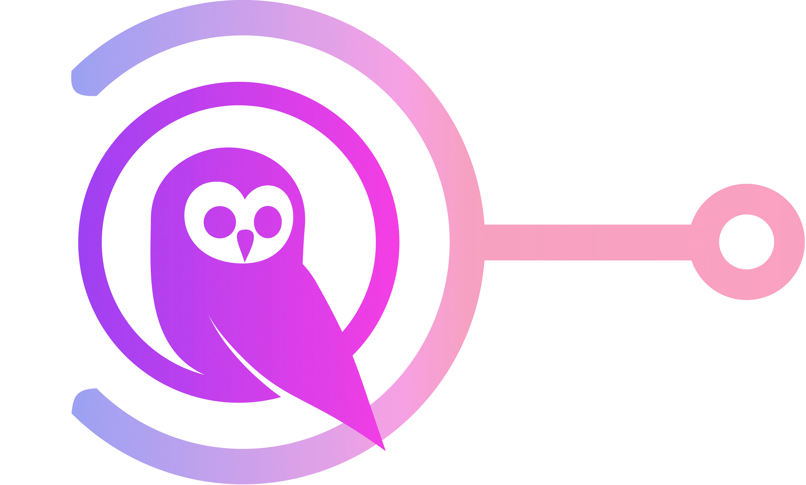

<p align="center">
  <a href="https://ousc.github.io/ng-prosemirror-adapter">
    
  </a>
</p>

<h1 align="center">
NG-PROSEMIRROR-ADAPTER
</h1>

[Angular](https://angular.dev/) adapter for [ProseMirror](https://prosemirror.net/), only supports Angular **17**+.

More detail please move to [**prosemirror-adapter**](https://github.com/Saul-Mirone/prosemirror-adapter) by [**@Saul-Mirone**](https://github.com/Saul-Mirone).**This project is just adding support for Angular.**

## Example

You can run this example by:

```bash
git clone https://github.com/ousc/ng-prosemirror-adapter.git
cd ng-prosemirror-adapter
npm install
npm run start
```

## Online Demo
[https://ousc.github.io/ng-prosemirror-adapter](https://ousc.github.io/ng-prosemirror-adapter/)

## Getting Started

### Install the package

```bash
npm install ng-prosemirror-adapter
```

### Wrap your component with provider

```html
<ng-prosemirror-adapter-provider>
  <YourAwesomeEditor/>
</ng-prosemirror-adapter-provider>
```

<details>

<summary>

### Play with node view

</summary>

In this section we will implement a node view for paragraph node.

#### Build component for [node view](https://prosemirror.net/docs/ref/#view.NodeView)

```ts
import {Component} from '@angular/core';
import {NgProsemirrorNode} from 'ng-prosemirror-adapter';


@Component({
  selector: 'paragraph',
  template: `
      <div role="presentation" [class.selected]="selected"></div>
  `,
  styles: [`
    :host .selected {
      outline: blue solid 1px;
    }
  `],
  standalone: true
})
export class Paragraph extends NgProsemirrorNode {}
```

#### Bind node view components with prosemirror

```ts
import {AfterViewInit, Component, ElementRef, forwardRef, ViewChild} from '@angular/core';
import {Paragraph} from "../paragraph.component";
import {NgProsemirrorEditor} from 'ng-prosemirror-adapter';

@Component({
  selector: 'editor',
  standalone: true,
  template: `<div class="editor" #editorRef></div>`,
  providers: [{provide: NgProsemirrorEditor, useExisting: forwardRef(() => EditorComponent)}],
})
export class EditorComponent extends NgProsemirrorEditor implements AfterViewInit {
  @ViewChild('editorRef') editorRef: ElementRef;

  async ngAfterViewInit(): Promise<void> {
    const element = this.editorRef.nativeElement;
    if (!element || element.firstChild)
      return

    const editorView = new EditorView(element, {
      state: YourProsemirrorEditorState,
      nodeViews: {
        paragraph: this.provider.createNodeView({
          component: Paragraph,
          as: 'div',
          contentAs: 'p',
        }),
      }
    })
  }
}

```

🚀 Congratulations! You have built your first angular node view with prosemirror-adapter.

</details>

<details>

<summary>

### Play with plugin view

</summary>

In this section we will implement a plugin view that will display the size of the document.

#### Build component for [plugin view](https://prosemirror.net/docs/ref/#state.PluginView)

```ts
import {Component} from '@angular/core';
import {NgProsemirrorPlugin} from 'ng-prosemirror-adapter';

@Component({
  selector: 'size',
  template: `<div>Size for document: {{ size }}</div>`,
  styles: [],
  standalone: true
})
export class Size extends NgProsemirrorPlugin {

  get size() {
    return this.state?.doc?.nodeSize
  }
}

```

#### Bind plugin view components with prosemirror

```tsx
import {AfterViewInit, Component, ElementRef, forwardRef, ViewChild} from '@angular/core';
import {Size} from "../size.component";
import {NgProsemirrorEditor} from 'ng-prosemirror-adapter';

@Component({
  selector: 'editor',
  standalone: true,
  template: `<div class="editor" #editorRef></div>`,
  providers: [{provide: NgProsemirrorEditor, useExisting: forwardRef(() => EditorComponent)}],
})
export class EditorComponent extends NgProsemirrorEditor implements AfterViewInit {
  @ViewChild('editorRef') editorRef: ElementRef;

  async ngAfterViewInit(): Promise<void> {
    const element = this.editorRef.nativeElement;
    if (!element || element.firstChild)
      return

    const editorView = new EditorView(element, {
      state: YourProsemirrorEditorState,
      plugins: [
        new Plugin({
          view: await this.provider.createPluginView({ component: Size }),
        }),
      ]
    })
  }
}
```

🚀 Congratulations! You have built your first angular plugin view with prosemirror-adapter.

</details>

<details>

<summary>

### Play with widget view

</summary>

In this section we will implement a widget view that will add hashes for heading when selected.

#### Build component for [widget decoration view](https://prosemirror.net/docs/ref/#view.Decoration%5Ewidget)

```ts
import {Component} from '@angular/core';
import {NgProsemirrorWidget} from 'ng-prosemirror-adapter';

@Component({
  selector: 'hashes',
  template: `
      <span class="hash">{{ hashes }}</span>`,
  styles: [`
    .hash {
      color: blue;
      margin-right: 6px;
    }`],
  standalone: true
})
export class Hashes extends NgProsemirrorWidget {
  get level() {
    return this.spec?.['level'];
  }

  get hashes() {
    return Array(this.level || 0).fill('#').join('');
  }
}

```

#### Bind widget view components with prosemirror

```ts
import {AfterViewInit, Component, ElementRef, forwardRef, ViewChild} from '@angular/core';
import {Hashes} from "../hashes.component";
import {NgProsemirrorEditor} from 'ng-prosemirror-adapter';
import {Plugin} from "prosemirror-state";

@Component({
  selector: 'editor',
  standalone: true,
  template: `<div class="editor" #editorRef></div>`,
  providers: [{provide: NgProsemirrorEditor, useExisting: forwardRef(() => EditorComponent)}],
})
export class EditorComponent extends NgProsemirrorEditor implements AfterViewInit {
  @ViewChild('editorRef') editorRef: ElementRef;

  async ngAfterViewInit(): Promise<void> {
    const element = this.editorRef.nativeElement;
    if (!element || element.firstChild)
      return

    const editorView = new EditorView(element, {
      state: YourProsemirrorEditorState,
      plugins: [
        new Plugin({
          props: {
            decorations: (state) => {
              const getHashWidget = this.provider.createWidgetView({
                as: 'i',
                component: Hashes,
              })
              const {$from} = state.selection
              const node = $from.node()
              if (node.type.name !== 'heading')
                return DecorationSet.empty

              const widget = getHashWidget($from.before() + 1, {
                side: -1,
                level: node.attrs['level'],
              })
              return DecorationSet.create(state.doc, [widget])
            },
          },
        }),
      ]
    })
  }
}
```

🚀 Congratulations! You have built your first angular widget view with prosemirror-adapter.

</details>

## API

if you properly wrap your component with `NgProsemirrorAdapterProvider`, and extends `NgProsemirrorEditor` or `NgProsemirrorNode` or `NgProsemirrorPlugin` or `NgProsemirrorWidget`, you can use `this.provider` to access the following APIs.
else you can use @ViewChild to access the NgProsemirrorAdapterProvider instance and use the following APIs.

<details>

<summary>

### NgProsemirrorNode API

</summary>

#### NgProsemirrorEditor.provider.createNodeView: NodeViewFactory => (options: NgNodeViewUserOptions) => NodeViewConstructor

```ts
type NgNodeViewUserOptions = {
  component: Type<NgProsemirrorNode>
  as?: string | HTMLElement
  contentAs?: string | HTMLElement
  update?: (node: Node, decorations: readonly Decoration[], innerDecorations: DecorationSource) => boolean | void
  ignoreMutation?: (mutation: MutationRecord) => boolean | void
  selectNode?: () => void
  deselectNode?: () => void
  setSelection?: (anchor: number, head: number, root: Document | ShadowRoot) => void
  stopEvent?: (event: Event) => boolean
  destroy?: () => void

  // Additional
  onUpdate?: () => void
  inputs?: {
    [key: string]: any
  },
  key?: string
}

type NodeViewFactory = (options: NgNodeViewUserOptions) => NodeViewConstructor
```

#### NgProsemirrorNode.context: NodeViewContext

```ts
interface NodeViewContext {
  // won't change
  contentRef: NodeViewContentRef
  view: EditorView
  getPos: () => number | undefined
  setAttrs: (attrs: Attrs) => void

  // changes between updates
  node: Node
  selected: boolean
  decorations: readonly Decoration[]
  innerDecorations: DecorationSource
}

type NodeViewContentRef = (node: HTMLElement | null) => void
```

### NgProsemirrorNode.view: EditorView

### NgProsemirrorNode.contentRef: NodeViewContentRef

### NgProsemirrorNode.getPos: () => number | undefined
  
### NgProsemirrorNode.setAttrs: (attrs: Attrs) => void

### NgProsemirrorNode.node: Node

### NgProsemirrorNode.selected: boolean

### NgProsemirrorNode.decorations: readonly Decoration[]

### NgProsemirrorNode.innerDecorations: DecorationSource


</details>

<details>

<summary>

### NgProsemirrorPlugin API

</summary>

#### NgProsemirrorEditor.provider.createPluginView: NodeViewFactory => (options: NgNodeViewUserOptions) => NodeViewConstructor

```ts
export type NgPluginViewUserOptions = {
  component: Type<NgProsemirrorPlugin>
  root?: (viewDOM: HTMLElement) => HTMLElement
  update?: (view: EditorView, prevState: EditorState) => void
  destroy?: () => void,
  inputs?: {
    [key: string]: any
  },
  key?: string
}

export type PluginViewFactory = (options: NgPluginViewUserOptions) => Promise<PluginViewSpec>

```

#### NgProsemirrorPlugin.context: PluginViewContext

```ts
export interface PluginViewContext {
  view: EditorView
  prevState: EditorState
}
```

#### NgProsemirrorPlugin.view: EditorView

#### NgProsemirrorPlugin.state: EditorState

#### NgProsemirrorPlugin.prevState: EditorState

</details>

<details>

<summary>

### NgProsemirrorWidget API

</summary>

#### NgProsemirrorEditor.provider.createWidgetView: WidgetViewFactory => (options: NgWidgetViewUserOptions) => WidgetViewConstructor

```ts
export type NgWidgetUserOptions = {
  as: string | HTMLElement
  component: Type<NgProsemirrorWidget>,
  inputs?: {
    [key: string]: any
  },
  key?: string
}

export type WidgetViewFactory = (options: NgWidgetUserOptions) => WidgetDecorationFactory
```

#### NgProsemirrorWidget.context: WidgetViewContext

```ts
export interface WidgetViewContext {
  view: EditorView
  getPos: () => number | undefined
  spec?: WidgetDecorationSpec
}
```

#### NgProsemirrorWidget.view: EditorView

#### NgProsemirrorWidget.getPos: () => number | undefined

#### NgProsemirrorWidget.spec: WidgetDecorationSpec

</details>

## Contributing

Contributions are welcome! Please feel free to submit a Pull Request.

## License

[MIT License](LICENSE)
